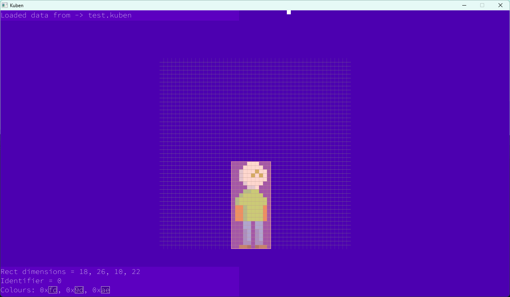

# Kuben - A program for making pixel-aligned hitboxes

## Note: This program is still very buggy!

Kuben is an SDL2 program for making hitboxes aligned to a pixel grid, saved as its own format `.kuben`.



## Usage

While Kuben is not inherently a command-line program, running it in a traditional terminal environment is advised, as some of the warnings and error go to `stderr`.

```
Usage: ./kuben <srcFile> <frameWidth> <frameHeight> <outFile>
```

### Keybinds

`ctrl+s` - Save to a file

`ctrl+shift+s` - Save to a new file & change `outFile` to the new one

`return` - Center sprite

`delete` - Deletes _all_ boxes.

## What does Kuben mean?

Norwegian for 'the cube' :^)=-=:
